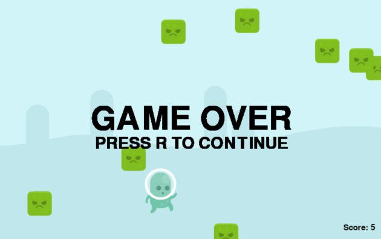

<center>
    <h1><b>Plates</b></h1>
</center><br>

<center>
    </img>
</center><br>
<hr>


> "Plates" is a small and simple game written by me 7 month ago.<br>
> It was made with Python PyGame framework

# How to play
Use arrows to move your character. Press space to stop him.<br>
Every three seconds of character's life your score increases by 1.<br>
Be afraid of green cubes, they want to kill you.

# Installlation
```bash
$ pip install pygame
```
```bash
$ git clone https://github.com/not-lum/plates.git
$ cd plates/Plates
$ python3 game.py
```


